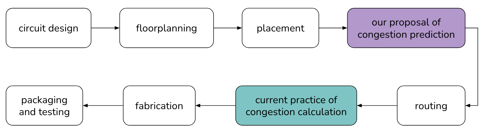
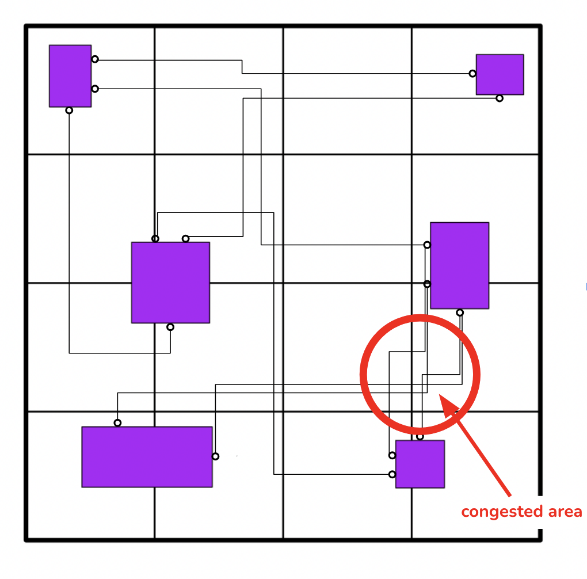
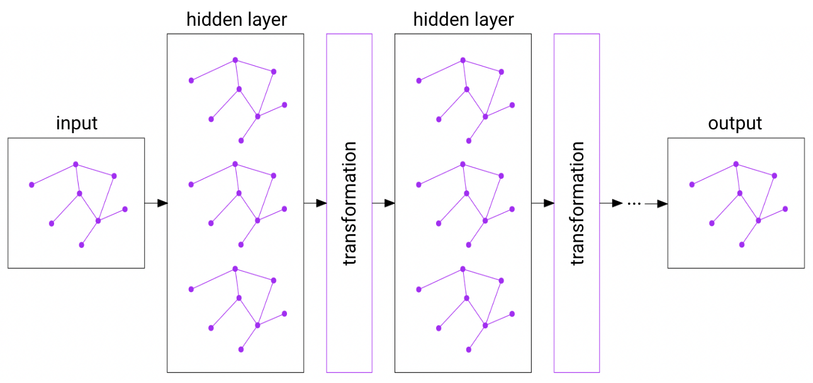
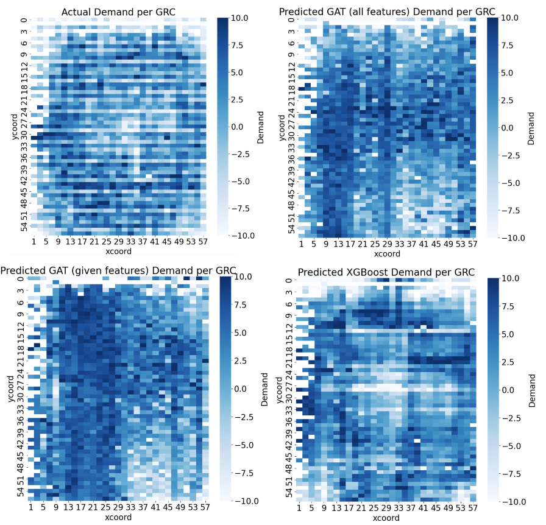

# Introduction
Congestion in Very Large-Scale Integration (VLSI) chip design presents a significant challenge, often discovered only after the placement and routing stages. Our project aims to predict congestion early using deep learning techniques, specifically a Graph Attention Network (GAT), to enhance chip design efficiency.  

*VLSI Chip Design Flow*

# Problem Statement
We seek to predict local congestion within semiconductor chips prior to routing, aiming to minimize the need for costly reiterations in the design process. Our focus is on identifying key factors influencing congestion to facilitate optimal chip placement and routing. Routing congestion occurs when the demand of wires in a given area exceeds the capacity.  
{:height="300px" width="300px" align="center"}  
*Congestion Depicted in a Netlist*

# Methods
Our approach involves exploratory data analysis (EDA) to understand the dataset, pre-processing data for model implementation, and training/testing our GAT model alongside a baseline XGBoost model. We engineer features such as coordinates, width, and pin count to enhance congestion prediction.  

*Graph Neural Network*

# Results
Experiments show that our GAT model, particularly with engineered features, outperforms the XGBoost model in learning congestion patterns. While XGBoost excels in assigning demand values accurately, the GAT model provides insights into congestion patterns, paving the way for more efficient chip design.  
{:height="400px" width="400px" align="center"}  
*Our Results*

# Conclusion
Our study explores the use of deep learning techniques for early congestion prediction in VLSI chip design. By leveraging GAT models with engineered features, we aim to improve chip design efficiency and contribute valuable insights to the field.

## Index Terms
* Very Large-Scale Integration
* Routing Congestion
* Deep Learning
* Graph Attention Network
* Post-Placement
* Pre-Routing